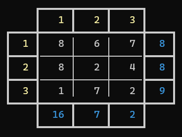
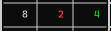
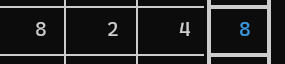
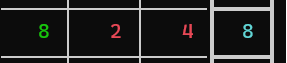
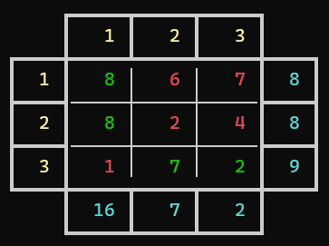

# Sumplete
## About this repository
  This repository is dedicated to the implementation of a terminal game developed as assignment for the introduction to programming course of the computer science course at UFOP (Universidade Federal de Ouro Preto).

> [!NOTE]
> This game was developed as a assignment for a brazilian university, so the whole game was made in brazillian portuguese, but the source code was all writed in english for accessibility.

## The game
  The Sumplete game was originally created with ChatGPT through some chatbot prompts. You can try out the [web version of the game](https://sumplete.com/) via this link, where you can also learn more about the creation process in the [About](https://sumplete.com/about/) section.

### How to play
  In Sumplete you have a board composed of an n by n matrix where each row and column has a "sum clue" associated with it. This clue tells you the sum of the numbers in that row and column. For exemple, if the sum clue for a row/column is 16, then the numbers in that row/column must add up to 16.

<p align="center">
   <br>
  <i>Fig.1 - 3 x 3 Sumplete board.</i>
</p>
  
  The cells of the board have tree different states: **Unknown**, **Keep** and **Deleted**. By default, all the cells are in the Unkown state. Your goal is to identify which cells to delete and which to keep to ensure that the sum in each column and row matches its corresponding "sum clue".

<p align="center">
   <br>
  <i>Fig.2 - Cell states: Unknown (White); Remove (Red); Keep (Green).</i>
</p>

  To mark a cell as deleted, type: ```remover xy```. This will remove the number in the x row, y column cell.

  To mark a cell you want to keep, type: ```manter xy```. This will keep the number in the x row, y column cell.

  You can also chage the cell state whenever you want, except turn it back to Unknown state, but sice the goal is to remove the cells that doesn't enter the sum, a cell in Unknown state has tha same effect as a cell marked to keep.

  Once you removed the cells that doesn't enter the sum, the sum clue  will light up indicating this is now a winning row/column.

<p align="center">
   <br>
  <i>Fig.3 - A not winning row.</i>
</p>

<p align="center">
   <br>
  <i>Fig.4 - A winnig row after marking.</i>
</p>

Once all "sum-clues" for rows and columns are lit up, you'll have won the game!.

<p align="center">
   <br>
  <i>Fig.5 - Sumplete board after solving.</i>
</p>

### In-game commands
  During gameplay, the following commands can be executed (Note the comands are in brazilian portuguese):
  - ```comandos```: show the list of in-game commands.
  - ```remover xy```: removes the item in the x row, y column cell.
  - ```manter xy```: keeps the item in the x row, y column cell.
  - ```dica```: marks to keep a random position that enters the sum.
  - ```resolver```: automatically solves the game for you.
  - ```salvar file.txt```: saves the current game in the _file.txt_ file.
  - ```voltar```: gets back to the main menu.


## Installation
  To install the game, you just have to clone this repository.

## Usage
  For running the game, you can just run the **_sumplete_** executable file for Linux and MacOS, or the **_sumplete.exe_** file for Windows.

  If you prefer, you can also run the *makefile* using ```make``` for any system in order to recreate the executable file. If you are going to do this, make sure the objects folder is empty so that the object files are recreated. You can clean the objects folder by running ```make clean``` on MacOS or Linux, unfortunataly for Windows this method does not work so, for now, you will have to delete them manually.
